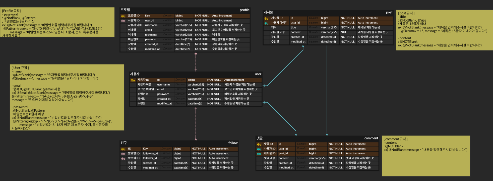

# 뉴스피드 프로젝트

* CRUD 중심으로 구현한 간단한 서비스

* 핵심 기능: 프로필 관리, 게시물 관리, 사용자 인증, 팔로우, 댓글 관리

---

## 1. 프로필 관리
- 프로필 조회
    - 내 프로필: 모든 정보 확인 가능함
    - 다른 사용자 프로필: 개인 정보(이메일, 비밀번호 등)는 제외함

    
- 프로필 수정
    - 로그인한 사용자만 본인 프로필 수정 가능함

- 비밀번호 수정
    - 현재 비밀번호 입력 시 일치하는 경우에만 변경 가능함
    - 기존 비밀번호와 동일한 비밀번호로는 변경 불가함
    - 비밀번호 형식 검증 (영문 대소문자, 숫자, 특수문자 포함 / 최소 8자 이상)

- 비밀번호 관련 예외 처리
    - 현재 비밀번호 불일치
    - 비밀번호 형식 불일치
    - 기존 비밀번호와 동일한 경우

---

## 2. 게시물 관리
- 게시물 작성, 조회, 수정, 삭제

- 게시물 수정 및 삭제는 작성자 본인만 가능함

- 뉴스피드 조회
    - 생성일 기준 내림차순 정렬
    - 페이지네이션 적용 (10개 단위)

- 예외 처리
    - 작성자가 아닌 사용자가 수정 또는 삭제 시도 시 예외를 발생시킴

---

## 3. 사용자 인증
- 회원가입
    - 아이디는 이메일 형식
    - 비밀번호는 Bcrypt 암호화 (직접 구현한 `PasswordEncoder` 사용)
    - 비밀번호 형식 검증 (영문 대소문자, 숫자, 특수문자 포함 / 최소 8자 이상)

- 로그인 / 로그아웃
    - 세션 기반 인증 (`HttpSession` 사용)

- 회원탈퇴
    - 비밀번호 확인 후 일치할 경우 탈퇴 가능함

- 예외 처리
    - 이메일/비밀번호 불일치

---

## 4. 팔로우 관리
- 특정 사용자 팔로우 / 언팔로우 가능

- 팔로잉 / 팔로워 목록 조회 가능

---

## 5. 댓글 관리
- 댓글 작성, 조회, 수정, 삭제

- 댓글 수정은 내용만 가능함
- 댓글 수정은 댓글 작성자만 가능함

- 댓글 삭제는 댓글 작성자 또는 게시글 작성자만 가능함

- 예외 처리
    - 권한 없는 사용자가 수정 또는 삭제 시도 시 예외를 발생시킴

---

## 기술 스택
- Backend: Spring Boot, Spring Data JPA

- Database: MySQL

- Build Tool: Gradle

- Security: 세션 기반 인증, Bcrypt 암호화

- Language: Java 17

---

## ERD

